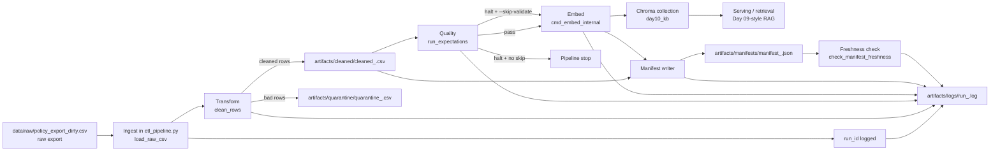

# Kiến trúc pipeline — Lab Day 10

**Nhóm:** C401 - D6  
**Cập nhật:** 2026-04-15

---

## 1. Sơ đồ luồng

**Giải thích các điểm observability chính:**

- `run_id` được tạo ở `cmd_run()` trong `etl_pipeline.py`, mặc định là UTC timestamp nếu người chạy không truyền `--run-id`.
- `run_id`, `raw_records`, `cleaned_records`, `quarantine_records` được ghi vào `artifacts/logs/run_<run_id>.log` qua hàm `_log()`.
- Dữ liệu bị loại không bị xóa im lặng mà được ghi ra `artifacts/quarantine/quarantine_<run_id>.csv` để phục vụ điều tra nguyên nhân.
- Freshness được đo sau khi manifest được ghi, dùng `latest_exported_at` trong manifest và so với `FRESHNESS_SLA_HOURS`.

---

## 2. Ranh giới trách nhiệm

| Thành phần | Input | Output | Owner nhóm |
|------------|-------|--------|------------|
| Ingest | `data/raw/policy_export_dirty.csv`, cấu hình `.env`, `run_id` | raw rows trong bộ nhớ, log `run_id`, `raw_records` | Lê Huy Hồng Nhật |
| Transform | raw rows từ ingest, allowlist `doc_id`, rule clean trong `transform/cleaning_rules.py` | cleaned rows, `artifacts/cleaned/cleaned_<run_id>.csv`, `artifacts/quarantine/quarantine_<run_id>.csv` | Nguyễn Quốc Khánh |
| Quality | cleaned rows từ transform, expectation suite trong `quality/expectations.py` | danh sách expectation pass/fail, tín hiệu `should_halt`, log expectation | Nguyễn Tuấn Khải |
| Embed | cleaned CSV, `chunk_id`, Chroma config (`CHROMA_DB_PATH`, `CHROMA_COLLECTION`) | vector store Chroma đã upsert/prune, log `embed_upsert` và `embed_prune_removed` | Phan Văn Tấn |
| Monitor | manifest JSON, `latest_exported_at`, SLA freshness | kết quả `PASS/WARN/FAIL`, chi tiết `age_hours`, giải thích vận hành trong runbook | Lê Công Thành |

**Ranh giới file chính:**

- Ingest điều phối bằng `etl_pipeline.py`.
- Transform tập trung ở `transform/cleaning_rules.py`.
- Quality tập trung ở `quality/expectations.py`.
- Monitoring tập trung ở `monitoring/freshness_check.py`.
- Tài liệu vận hành nằm trong `docs/runbook.md` và tài liệu kiến trúc này.

---

## 3. Idempotency & rerun

Pipeline này dùng chiến lược **snapshot publish** cho vector store, không phải append-only.

- Mỗi bản ghi cleaned được gán `chunk_id` ổn định bằng `_stable_chunk_id(doc_id, chunk_text, seq)`.
- Khi embed, `cmd_embed_internal()` đọc lại cleaned CSV rồi thực hiện `col.upsert(ids=ids, documents=documents, metadatas=metadatas)`.
- Trước khi upsert, pipeline lấy toàn bộ `ids` đang có trong collection và xóa các `id` không còn xuất hiện trong cleaned run hiện tại. Số lượng bị xóa được log bằng `embed_prune_removed=<n>`.

Hệ quả vận hành:

- Nếu chạy lại cùng một cleaned dataset, collection không bị phình vì cùng `chunk_id` sẽ được upsert đè thay vì sinh vector mới.
- Nếu dữ liệu mới loại bỏ một chunk cũ, bước prune sẽ xóa vector stale để tránh top-k retrieval vẫn trả về ngữ cảnh lỗi thời.
- Đây là lý do pipeline phù hợp với yêu cầu Day 10 về observability: retrieval đúng không chỉ nhờ top-1 đúng mà còn phải tránh `hits_forbidden` trong toàn bộ top-k.

Điểm cần lưu ý là độ ổn định của `chunk_id` hiện phụ thuộc cả `seq`, nên nhóm cần rerun trên cùng cleaned dataset để xác nhận thực tế collection không tăng số lượng tài liệu sau lần chạy thứ hai.

---

## 4. Liên hệ Day 09

Day 09 tập trung ở tầng orchestration và retrieval của agent. Day 10 bổ sung tầng dữ liệu phía dưới để đảm bảo agent Day 09 đọc đúng corpus đã được làm sạch và publish có kiểm soát.

- Theo docstring của `etl_pipeline.py`, Day 10 tiếp nối Day 09 và dùng cùng case CS + IT Helpdesk.
- Canonical knowledge vẫn bám theo bộ tài liệu trong `data/docs/` và các `doc_id` tương ứng trong `contracts/data_contract.yaml` như `policy_refund_v4`, `hr_leave_policy`, `it_helpdesk_faq`.
- Raw input của Day 10 là `data/raw/policy_export_dirty.csv`, mô phỏng export từ DB/API trước khi được làm sạch và re-embed.
- Sau khi pipeline chạy xong, Chroma collection `day10_kb` trở thành corpus publish mới cho retrieval, tức là Day 09-style serving chỉ nên đọc từ snapshot đã qua clean, validate và embed của Day 10.

Tóm lại, Day 09 trả lời câu hỏi người dùng, còn Day 10 đảm bảo dữ liệu mà Day 09 truy xuất là đúng phiên bản, đúng schema và còn nằm trong SLA freshness.

---

## 5. Rủi ro đã biết

- Nếu `latest_exported_at` trong cleaned rows quá cũ so với `FRESHNESS_SLA_HOURS`, freshness sẽ `FAIL` và cần điều tra xem lỗi nằm ở nguồn export hay lịch chạy batch.
- Nếu manifest không có timestamp hợp lệ, `check_manifest_freshness()` trả `WARN`, làm giảm độ tin cậy của monitoring dù pipeline vẫn có thể chạy xong.
- Nếu expectation `halt` fail trên clean data, pipeline dừng trước bước embed và không publish snapshot mới.
- Nếu dùng `--skip-validate`, pipeline vẫn có thể embed dữ liệu xấu; chế độ này chỉ phù hợp cho Sprint 3 khi cố tình inject corruption để tạo evidence before/after.
- Nếu prune không chạy hoặc collection giữ lại vector stale, retrieval có thể xuất hiện `hits_forbidden=true` dù câu trả lời nhìn bề ngoài vẫn đúng.
- `chunk_id` hiện phụ thuộc vào `seq`; nếu logic sắp xếp hoặc dedupe thay đổi giữa hai run, cần kiểm tra lại độ ổn định của id trước khi kết luận idempotency hoàn toàn.
- ChromaDB hoặc model embedding lỗi sẽ làm hỏng bước publish cuối, khiến manifest/log có thể tồn tại nhưng collection chưa được cập nhật đúng.
